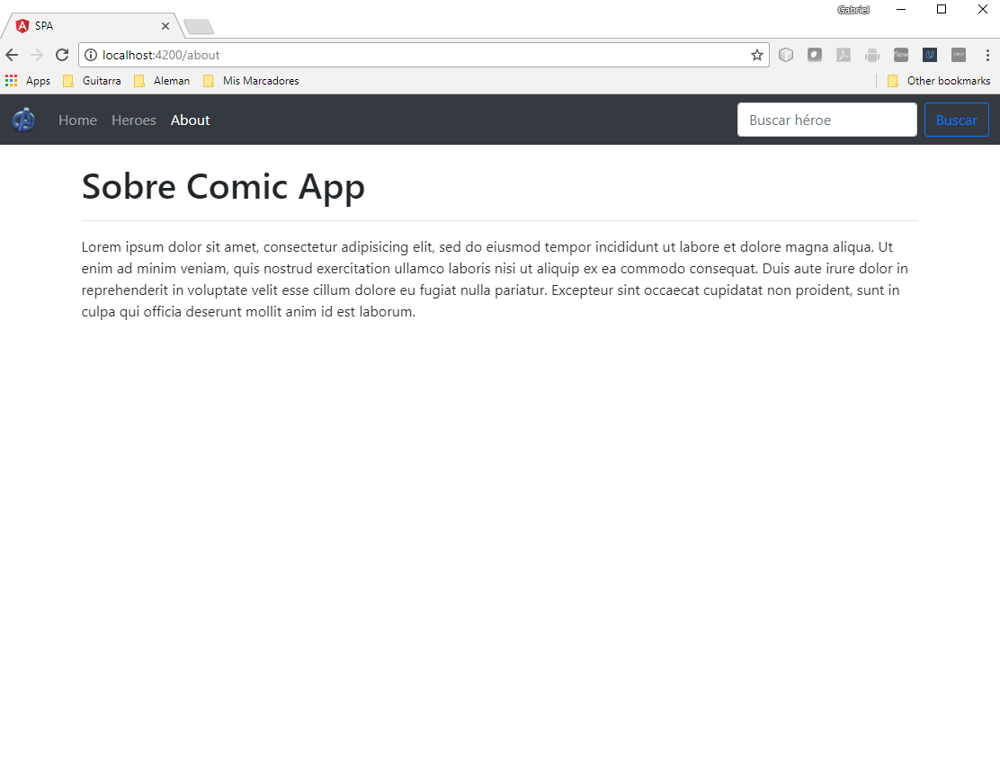

# Single Page application (SPA)

## ¿Qué veremos en este Proyecto?

A continuación vamos a aprender sobre los siguientes temas:

1. Crearemos una aplicación de una sola página (Single Page Application)
2. Creación de proyectos de Angular usando el CLI (Command Line Interface)
3. Instalando bootstrap o librerías de terceros usando el Angular-CLI
4. Creación de rutas de nuestra aplicación
5. Uso de RouterLink y RouterLinkActive para movernos de página y colocar clases a los elementos activos.
6. Uso del modulo Router, que nos permite movernos de página mediante código.
7. Obtención de parámetros vía URL.
8. Configuración de nuestro primer servicio en Angular para el manejo de la data.
9. Breve introducción a los Pipes 
10. Uso del buscador del navbar para realizar una consulta a nuestro arreglo de héroes.

## Screenshots

## Referencias a Angular CLI

This project was generated with [Angular CLI](https://github.com/angular/angular-cli) version 1.7.0.

### Development server

Run `ng serve` for a dev server. Navigate to `http://localhost:4200/`. The app will automatically reload if you change any of the source files.

### Code scaffolding

Run `ng generate component component-name` to generate a new component. You can also use `ng generate directive|pipe|service|class|guard|interface|enum|module`.

### Build

Run `ng build` to build the project. The build artifacts will be stored in the `dist/` directory. Use the `-prod` flag for a production build.

### Running unit tests

Run `ng test` to execute the unit tests via [Karma](https://karma-runner.github.io).

### Running end-to-end tests

Run `ng e2e` to execute the end-to-end tests via [Protractor](http://www.protractortest.org/).

### Further help

To get more help on the Angular CLI use `ng help` or go check out the [Angular CLI README](https://github.com/angular/angular-cli/blob/master/README.md).
